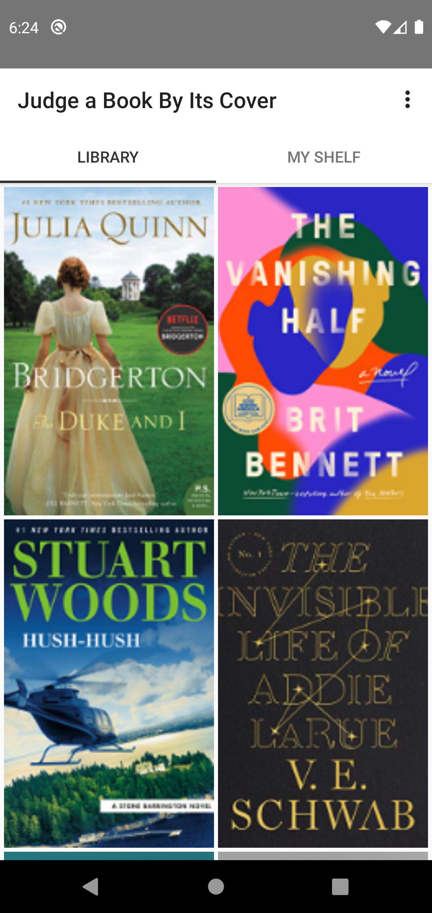
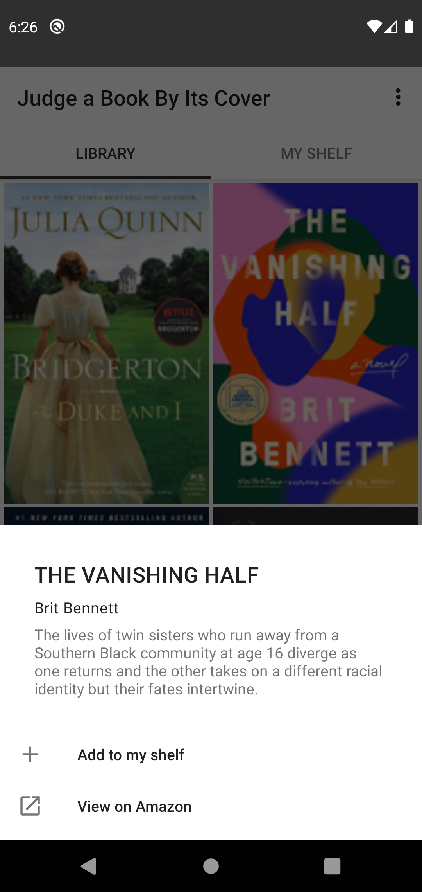
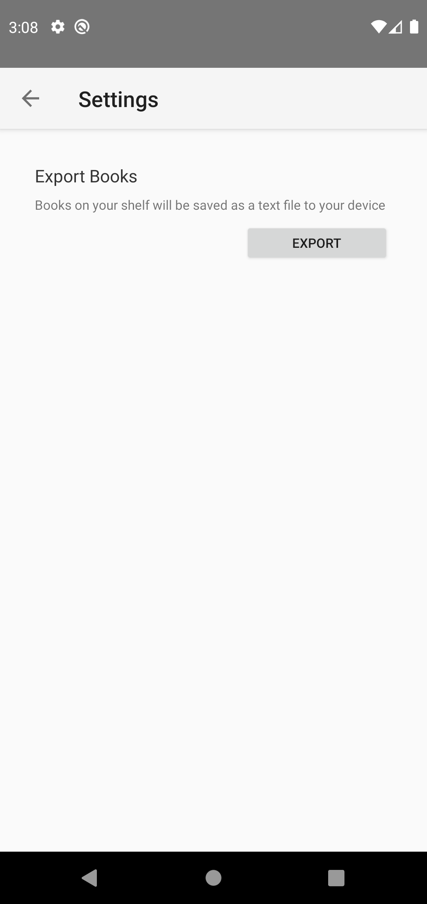

# Judge a Book By Its Cover 

We've always been told to not judge a book by its cover, so I decided to make an app that encourages doing the complete opposite. Looking at book covers is reminiscent of the days of browsing an actual library. The cover is the first thing you see when you pull a book from the shelf and can range from artistic to minimalist to thought-provoking. This app features the book covers of the most recent New York Times Best Seller lists and allows you to save your favorites to your bookshelf. So judge away, and pick your next read!

 

## Requirements

### Activities

- Main activity
  - This activity is the entry point of the app. It displays a scrolling gallery of covers of this week's best sellers using a recycler view and grid layout. The top app bar collapses when scrolling down while the tabs remain in view for clear user navigation. 
  - The tab layout has 2 tabs: one is the Library, where the user can browse all the best sellers; the second is My Shelf, where users can see their saved books (a new user's shelf is empty). Users can either click or swipe between the tabs. 
  
 

- Settings activity
  - This activity is accessed from the 3-dot overflow menu on the Main Activity. The only functionality of this page currently is to export a user's shelf.

### Fragments

- Home and Shelf fragments
  - Both tabs are implemented using fragments in order to take advantage of tab layout and ViewPager. Because Library and My Shelf have parallel layouts, using fragments also allowed for code reusability and a shared app bar. 
- Detail fragment
  - This fragment is a BottomSheetDialog that displays information about each book and 2 actions: adding or removing books to My Shelf, and viewing the book's Amazon listing. 
  - It is used to display details for books in both the Library and My Shelf tabs. 
  - Both Add and Remove actions are immediately reflected in My Shelf.
  

### Service

- Export service
  - Within Settings, the Export button launches a service that queries the Room repository and exports to CSV all the books in My Shelf. This operation does not take long, but running it in as a service ensures that the export will complete even if the user leaves the app. 
 

### MVP

- Views - Fragments and Activities. These reference their presenter classes so they can notify presenters of new user input. 
- Presenters - Presenters update the model and implement callbacks to the view so that the views know when they need to update. 
- Contracts - These are interfaces that I use to establish the View - Presenter relationship. BaseContract defines basic methods that every View and Presenter implements, and there are additional View specific contracts for each relationship. 
- Model - I use the repository pattern to create an abstraction layer for data access from multiple data sources: local (Room) and remote (NytApi). Room is used to persist the books that the user saved to their shelf, and the NYT API is used to fetch the book cover images and book details. Database objects (I called mine Books) are defined here. 

### REST API

- This app uses the NYT Books API https://developer.nytimes.com/docs/books-product/1/overview to get the Best Sellers List for the most recent week. 
- I used Retrofit2 and Moshi to asychronously send the server request, process the response, and notify callbacks to ensure non-blocking UI performance. 

### Material Design Components

- App bar is a collapsing toolbar
- Tabs to easily navigate between Library and My Shelf
- Book details implemented using a bottom sheet dialog
- Snackbars to provide feedback to the user upon actions like adding/removing books 
- Export button in Settings

### Data Persistence

- Room is used to persist the books that a user has saved to their shelf. 
- Calls to Room are made from nonblocking coroutines.

### Future Work

- Incorporate data from Google Books API to build a search by keyword and search by genre feature
- Dark mode browsing
- See best seller lists by list name
- View best seller lists by date (see previous weeks best sellers and not just current week's)
- Leverage Dagger2 for dependency injection
